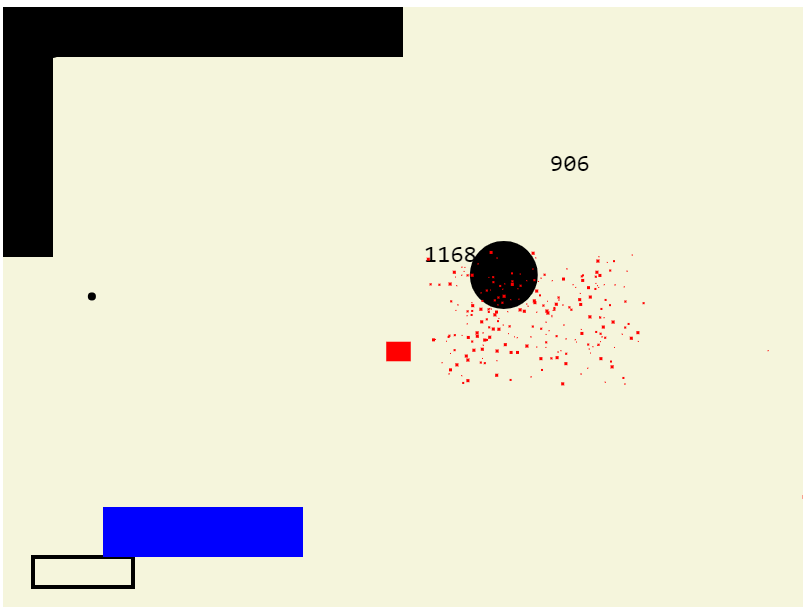

Build with `pub build`, open `index.html` from the `build` folder to run. This repo contains the built version since dart 1 is outdated and may not be supported in the future.

## Screenshot

## Instructions
Use the mouse to aim, hold down to charge, release to fire your dart.

Hitting red rectangles rewards points, hitting several with one dart will multiply the score.

Black walls block your dart, blue walls make your ball bounce off with force, purple walls will make your ball bounce off in the inverted direction.